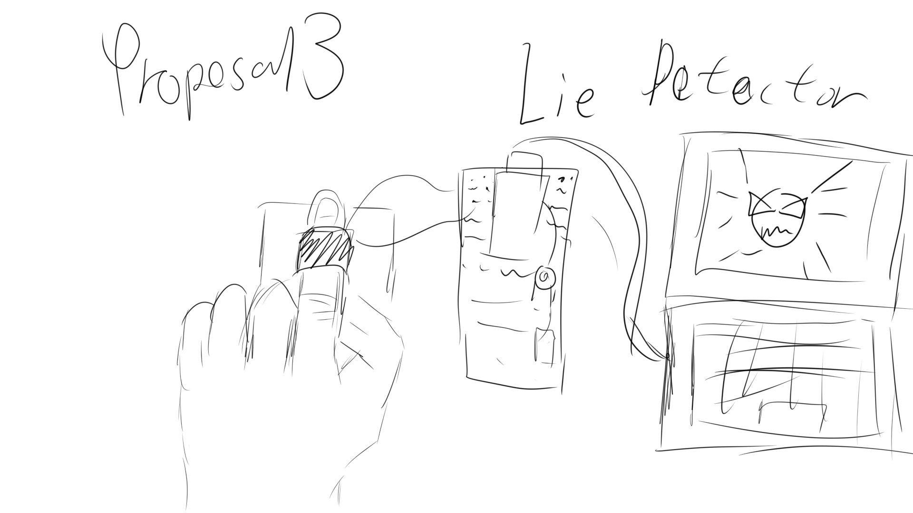

# Final Project Proposal

Proposal 1:
My first project idea is to create an interactive virtual pet. I believe the machine learning aspect of the previous p5.js assignment has more potential, so I hope to continue this topic in this project. Overall, the final effect of this project is that the player can interact with the pet using their right hand, such as petting or pinching different parts of it. Meanwhile, the player's left hand needs to be placed on a breadboard, and the pet will react with lights and even "attack" the player with a motor-controlled hand.

Proposal 2:
My second project idea is to create a game controlled by a “game controller”. I've seen videos where a joystick can be used as an input device. Using a joystick and buttons, a simple game controller can be created. Even if a joystick is not available, devices like variable resistors can also provide rich interactive features. These inputs would be used to control a small game in p5.js. I don't have specific ideas for this yet. My initial concept is for the player to control a small car or character in a scene, dodging obstacles and attacking targets.

Proposal 3:
My third project idea is more challenging. Inspired by the banana example you included in the last material, I thought about lie detectors, which seem to work through changes in resistance. So, I'm considering using this principle for a project. p5.js would provide feedback based on the input information, or it could serve as the interface for this game.
